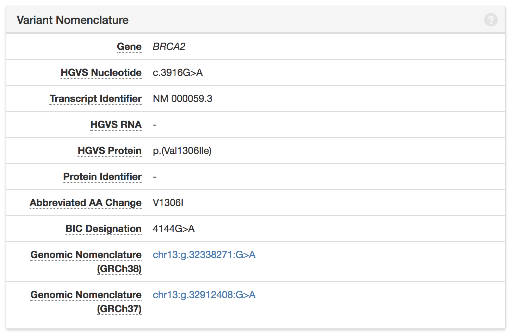
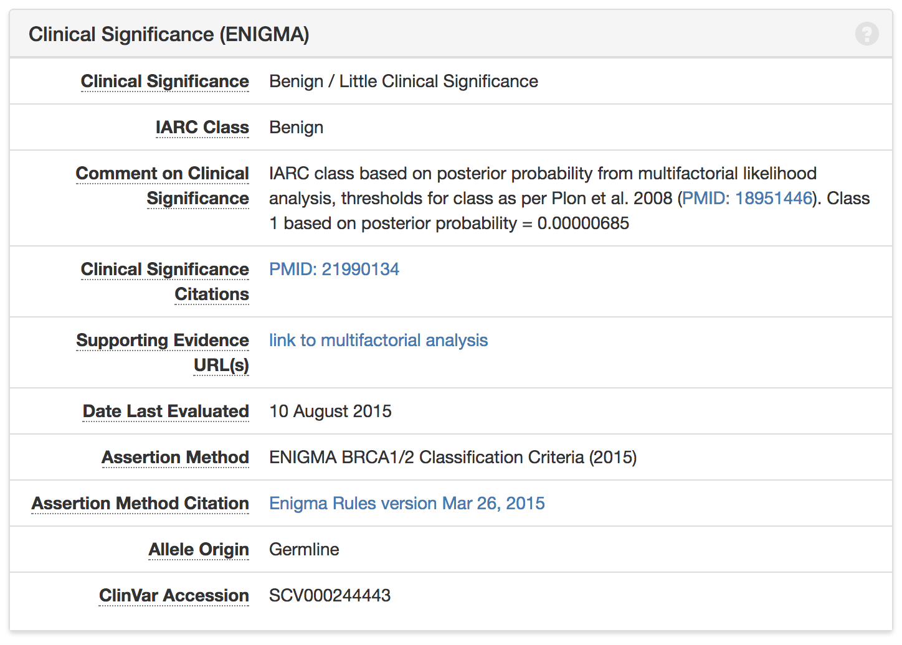
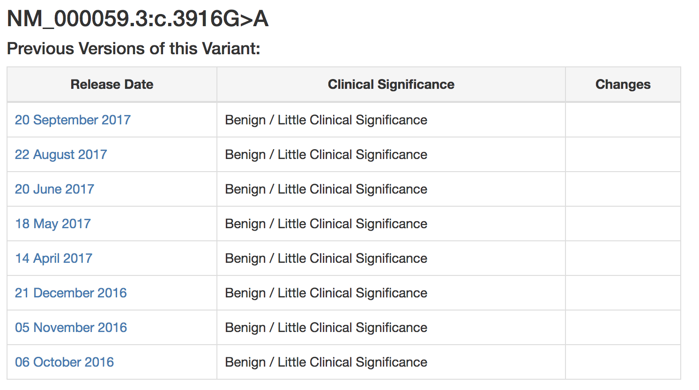

# Tell me more about Variant Details

## The “Variant Nomenclature” Tile

The first thing to note is that ‘nomenclature’ is just another word for ‘name.’ In other words, the variant nomenclature tile contains all the different names your variant has. Each name describes the same change in a BRCA-1 or BRCA-2 gene, regardless of the person it is found in. Below are descriptions of each naming convention:

* “Gene” row indicates which gene the variant is on, BRCA1 or BRCA2. 
* “HGVS Nucleotide,” “HGVS RNA,” and “HGVS Protein” names: all use a standard format provided by the Human Genome Variation Society, described {here} in our documentation
* “Transcript Identifier”/ “Protein Identifier”: a kind of ID number used by scientists in other databases
* “Abreviated AA Change”:a name that indicates what has changed in the protein, using {single letter amino acid abbreviations}
* “BIC Designation”: a naming format used by the Breast Cancer Information Core. 
* “Genomic Nomenclature”: a standard genomic name format, also provided by HGVS, which can be used when working with an entire genome

## The “Clinical Significance” Tile

This tile contains all information relevant to your genetic test result, whether you were found to have a “deleterious,” “pathogenic”, “benign”, “clinically significant”, or “variant of unknown significance.” For more information on these classifications, visit our {classifications documentation}.

BRCA Exchange uses 5 basic categories, that might not align exactly with your genetic testing companies’ choice of words:

* Pathogenic variants confer an increased risk of disease.
* Likely pathogenic variants have good evidence to support an association with disease risk.
* Likely benign variants have good evidence to support no association with disease risk.
* Benign / Little Clinical Significance variants are not associated with any markedly increased risk of disease.
* Variants of uncertain significance \(VUS\) are those for which the evidence of disease risk is not clear yet, sometimes because there is not yet enough evidence to classify them as either pathogenic or benign

These classifications will be found int he Clinical Significance tile:Because you are accessing the Expert Reviewed Database \(check top right corner for “Expert Reviewed” under logo\), your variant will have an unambiguous classification. All variants in the database have been reviewed by experts to ensure that the classification is most reliable, so that you can be sure and up-to-date on your variant’s classification. Below are descriptions of each field on the Clinical Significance tile:

* The &lt;Clinical Significance Row/IARC class&gt;: the interpretation, or classification, of how risky the searched variant is
* Comment on Clinical Significance: notes on statistical analysis used to find signficance, intended for expert researchers
* Clinical Significance Citations/Supporting Evidence URL: link and ID number to the published paper on PubMed, a scientific article database, stating the significance of the variant, as well as links to other papers that support the interpretation
* &lt;Date Last Evaluated&gt;: the last date on which the variant was reviewed by experts 
* Assertion Method/Assertion Method Citation: the criteria and methods used by experts to classify the variant as pathogenic, benign, etc. 
* Allele Origin: ?????
* ClinVar Accession: ID number for this variant in ClinVar, another variant database

## The “Previous Versions of this Variant” Tile

This tile gives information of the significance of the variant at each release of BRCA Exchange. Additionally, you may click each date to see how many new variants have been classified at each release, and to explore variants whose classifications have changed. Finally, the “Show All Public Data on this Variant” button refreshes the variant entry to use the “All Public Data Portal,” which will show much, much more information.

This information can help researchers and doctors gain more information on a variant, such as different data submission sources, allele frequencies, and data obtained through the statistical analysis of the variant. Though this data is helpful to experts trying to classify Variants of Unknown Significance, it might not be useful to the everyday user who is trying to learn more about a variant that has been found through genetic testing.

