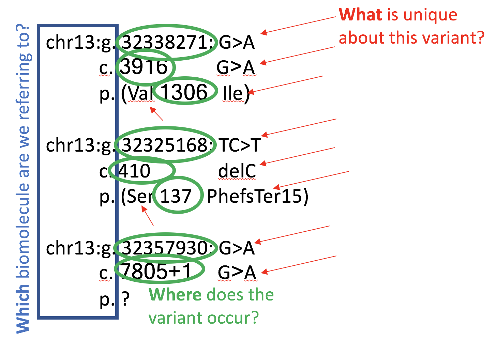

# What do all of those symbols, numbers, and letters in my variant name mean?

If you obtained your genetic test report, you may have been very confused by the string of letters and numbers that is listed as your “mutation,” “variant,” or “result.” These strings, or variants, can have a lot of different patterns: \[LIST OF ALL KINDS OF VARIANTS\]. A variant is often called a mutation, though they can mean slightly different things depending on the context. This is why we stick to describing your DNA change as a variant. The symbols, numbers, and letters are your &lt;variant name&gt;. Scientists actually have a systematic way of naming variants, which correspond to their location in the genome. So, you can also think of your variant name \(or nomenclature\) as a kind of address, or even as a coordinate location on a map.

To give an analogy, UC Santa Cruz is located at 1156 High St. Santa Cruz, CA. The GPS coordinate for this address are 40.741895N,-73.989308W. All of those letters and numbers for your variant are much like these coordinates. Each variant is named using its coordinate. Much like the same place can be named with both an address and a GPS coordinate, one variant can actually have multiple names depending on which coordinate system is being used. Most basically, a variant name answers 3 basic questions: /Where/ does a variant occur in the sequence?; /What/ is unique at this location?; and /which/ reference system is being used?

Having consistent ways of naming variants helps make genetic tests more reliable by ensuring that data is easier to manage. This standard format helps computer programs that aid analysis be written more easily. Although two unrelated people might have very different qualities, they may both have the same variant on the BRCA-1 or BRCA-2 gene. Being able to connect these two people through a variant that they have in common, and assessing their familial and clinical histories of cancer, helps scientists connect the dots about cancer risk associated with that variant.

[Tell me more about the coordinate-naming system for variants](tell-me-more-about-the-coordinate-naming-systems-for-variants.md)

