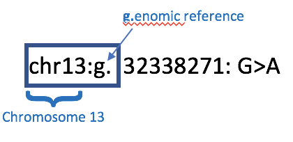
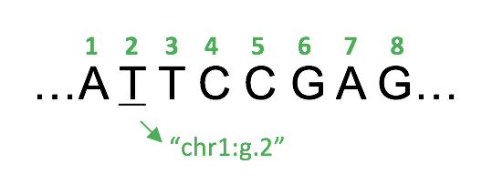
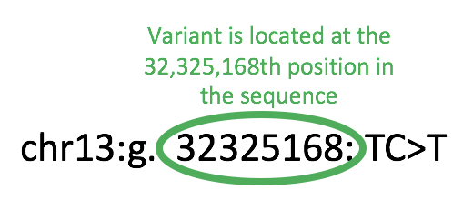
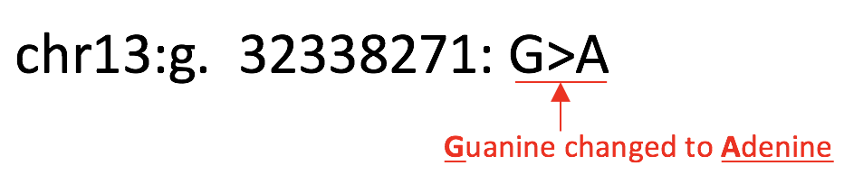
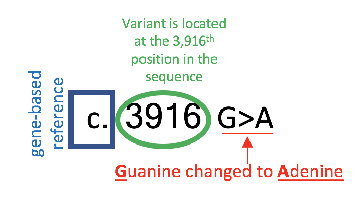
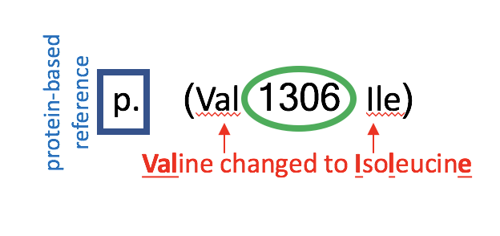
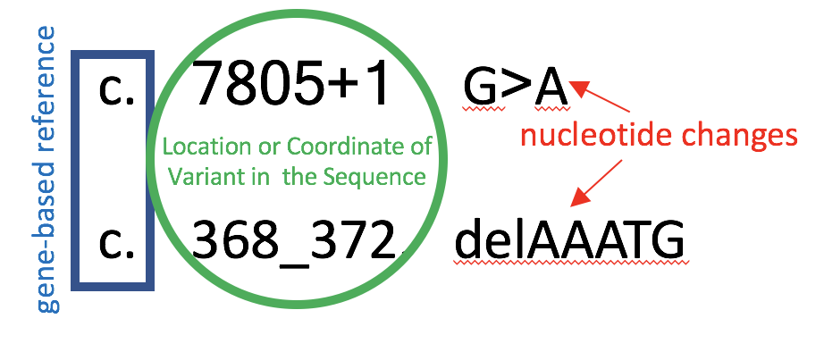

# Tell me more about the coordinate-naming systems for variants

The easiest variant names to decode are the &lt;substitution variants&gt;, also known as a point mutations or single nucleotide variants \(SNVs\). Most basically, they are a kind of variant “substitution of one base pair for another” \(Alberts 218\). When a gene contains a substitution variant, there might be a ‘misspelling’ in its instructions that only includes one letter being replaced with another. A substitution variant’s name tells us which sequence reference \(genome-based, gene-based, or protein-based\) is being used to describe the substitution variant, where the variant is in the sequence, and what single nucleotide change occurred at that location.

Let’s get back to BRCA2, and the variant 'chr13:g.32338271:G&gt;A'. Chromosome 13, where BRCA2 is found, is made up of about 115 million base pairs \([https://ghr.nlm.nih.gov/chromosome/13\](https://ghr.nlm.nih.gov/chromosome/13%29\). Recall that {chromosomes are inherited by your parents} and carry your genes, which have slight differences, or variants, that make you unique.

So, the first question to ask when looking at a variant is “Which sequence-reference is being used?” The answer lies in the first few letters. In this case, the variant is referencing chromosomal DNA \(the g.enome\):

The genome-based reference is like having a GPS mapping of a whole state: just like a map of California includes all of its cities, the genome-based reference includes all of a chromosome’s genes and nucleotides. In order to map Chromosome 13’s nucleotides, each one is numbered 1-115,000,000. Numbering the nucleotides keeps track of where the variant is. To use a simple example, let’s pretend Chromosome 1 is only 8 nucleotides long, and that its digital sequence is provided below. We can refer to the first T in the sequence using variant nomenclature, noting that the first T is at position 2, perhaps using a name like “chr1:g.2”.

The next step in decoding the 'chr13:g.32338271:G&gt;A' variant is using the number following the “g.” to answer “Where does the variant occur in the sequence?”. In this case, the variant has a change at the 32,338,271th position on chromosome 13, as given by its genomic number or 'coordinate':

The next step in decoding the 'chr13:g.32338271:G&gt;A' variant is using the number following the “g.” to answer “Where does the variant occur in the sequence?”. In this case, the variant has a change at the 32,338,271th position on chromosome 13, as given by its genomic number or 'coordinate':

We have now discussed how the name ‘chr13:g.32338271:G&gt;A’ describes which chromosome we are talking about, where your DNA differs from the {reference sequence}, and what is different about your DNA. But what about the other references that are used?

Although having a genome-based reference is helpful, sometimes scientists only want to focus on one gene. This is where a gene-based reference is helpful, which is indicated by a “c.” at the beginning of the variant name. Rather than numbering all 115,000,000 nucleotides on chromosome 13, we can ‘zoom-in’ on only the 84,000 nucleotides that make up BRCA2. The gene-based, or “c.”, reference can be thought of as a map of one city, instead of a whole country. c.3916G&gt;A

Just like you can be in the same neighborhood on both a state’s map and a city’s map, the same variant can be referenced using all of chromosome 13, or only the BRCA2 gene. The “c.” gene-based reference implements the name “c.3916G&gt;A.” The c. indicates that we are only numbering the 84,000 nucleotides within the BRCA2 gene, the 3916 indicates the position within the gene, and the “G&gt;A” indicates the nucleotide change, telling us that a G was substituted with an A. Again, this is the same variant using a different reference: the gene.

The final reference available uses a “p.”, which indicates a protein-based variant name. The “p.” version of the variant above is “p.\(Val1306Ile\)”. To answer “What changed in this variant?” the p. nomenclature references {&lt;amino acids&gt;} that changed as a result of the variant, rather than nucleotides. The protein-based reference doesn’t refer to nucleotides because the cell has already processed the gene instructions to make a chain of amino acids. Because genes code for proteins, a change in the gene often results in a change in the protein. The p. nomenclature demonstrates this protein change.

Sometimes, a protein will remain unchanged, even if there is a variant in its gene instructions. Other times, even though a variant affects the amino acid sequence, the protein maintains its structure. These are examples of a harmless, or &lt;benign&gt;, substitution mutations. However, if the substitution takes place at a crucial location in the gene sequence, a substitution variant can have a greater impact on a person’s health, making it &lt;pathogenic&gt;. We often don’t know how important a particular region of a gene is, which is why sometimes these variants turn out to be a &lt;VUS&gt;. Because there is not a simple rule for classifying variants, BRCA Exchange supports the curation of variants to develop expert classifications, based on a wide variety of risk considerations that experts make.

Substitution variants are perhaps the easiest names to understand, but as the variant gets more complicated, the names can get more intimidating. Even if you do not understand the specifics, you can still get a general idea of what your variant name means.

If a variant name looks very complex, try recalling the three questions:

* /Which/ reference are we using?  
* /Where/ does the variant occur in the sequence?
* /What/ has changed about this variant? 

Although variants can be understood as either being substitution or indel variants, many variants require more biological knowledge to understand the specifics of them. They might have symbols in them like ‘\_’, ‘+’, ‘-‘, etc. However, even the most complex variants can be understood in the general /Which, Where, What/ format:

\[PERHAPS PROVIDE A LIST OF ALL ABBREVIATIONS USED IN NOMENCLATURE, LIKE SINGLE LETTER PROTEIN NAMES, ‘TER’, AND ‘fs’; perhaps mention the BIC reference without explaining it too much?\] \[UPDATE PICTURE/TEXT TO INCLUDE AA ABBREVIATIONS SOMEHOW BC THOSE SHOW UP ON GENETIC TESTS\]

