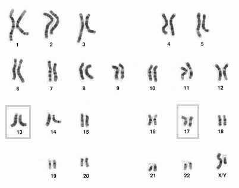
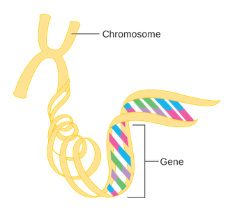

# Tell me more about inheritance of genes and variants

You can think of chromosomes like sets of books your parents gave you. Imagine that you got one set of 23 books from one parent, and another set of 23 books from the other parent. When you look at the titles of these books, they are the exact same: you end up with two copies of the same 23 books. Now imagine each set of books had different editors. Even though the two books are almost the same, there may be slight differences inside. The same is true for chromosomes: even though the sets of chromosomes are largely the same, there are some differences depending on which parent they came from.

When scientists study chromosomes, they number each pair of chromosomes from largest to smallest. Most people have 23 pairs of chromosomes, 46 total. Every cell in your body has the same 23 pairs of chromosomes. These chromosomes contain the instructions needed to make all of your proteins, which cause your cells, tissues, and organs to develop and function properly.

The BRCA1 gene is located on chromosome 17, while BRCA2 is located on chromosome 13. For our purpose, we will focus on BRCA2.

Everybody inherits two BRCA2 genes, one from each parent. A gene can be thought of like a word in one of your chromosome ‘books.’ For example, if Don Quixote is translated and printed in England, they might describe the colour of Don Quixote’s hair. In the American version, though, this word might be printed as color. These two copies have slightly different words, but overall, the same word is being used effectively.

Similarly, genes can be very similar to one another, but are often not identical because one may contain small differences. One inherited gene might differ in spelling from another inherited gene; additionally, those two genes might also be spelled differently than those found in the rest of the population. In other words, your gene copies are often slightly, but not entirely, different when compared to other people’s. So, even though we all have the same genes in our DNA, many of us have genes that are spelled in unique ways. This different spelling is called a &lt;variant&gt;, which is a specific change at a specific location in your DNA.

